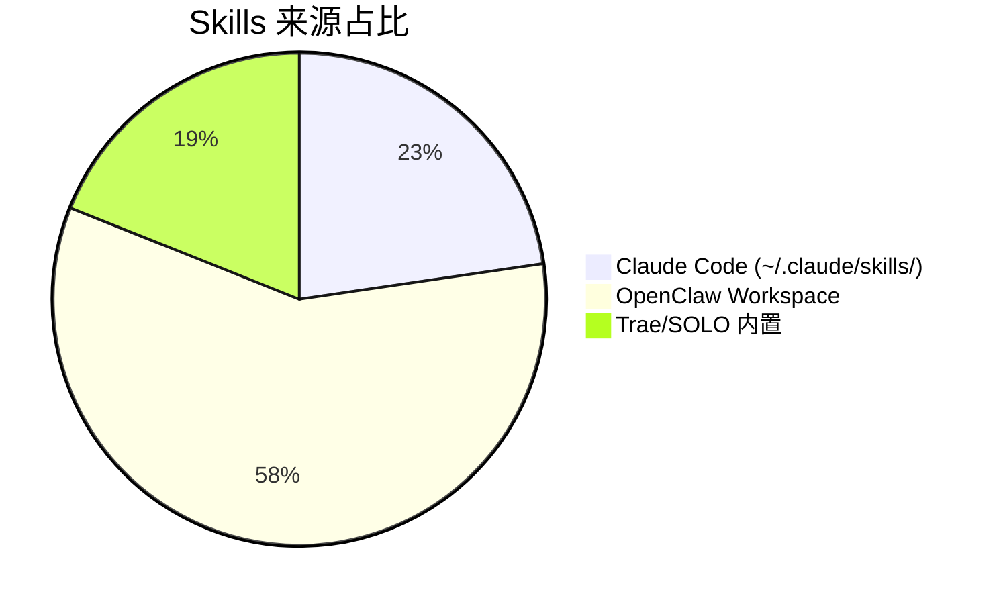

# Skills 每日统计报告 - 2026-05-10

> 本报告统计本地所有技能目录，覆盖 Claude Code、OpenClaw、Trae/SOLO 三大来源

---

## 统计摘要

| 指标 | 数值 | 变化 |
|:-----|:-----|:-----|
| **Claude Code Skills** | 158 个 | 顶层目录 |
| **Trae/SOLO Skills** | 132 个 | 内置技能 |
| **OpenClaw Workspace Skills** | 406 个 | 工作区技能 |
| **总计（去重估算）** | **~696 个** | - |

---

## 来源分布



| 来源 | 数量 | 占比 |
|:-----|:-----|:-----|
| Claude Code | 158 | 22.7% |
| OpenClaw | 406 | 58.3% |
| Trae/SOLO | 132 | 19.0% |

---

## 高星仓库贡献统计

| 仓库 | Stars | 本地路径 | 贡献技能数 |
|:-----|:------|:---------|:-----------|
| alirezarezvani/claude-skills | 5,200+ | `.claude/skills/alirezarezvani/` | ~180 |
| nexu-io/open-design | 15,000+ | `.claude/skills/open-design/` | ~65 |
| mattpocock/skills | 37,000+ | `.claude/projects/mattpocock-skills/` | ~23 |

**高星仓库合计贡献：~268 个技能（占总量的 38.5%）**

---

## 系列技能分类

### alirezarezvani 系列（~180 个）
- C-Suite 高管顾问（28+ 个）
- 工程核心（37 个）
- 市场营销（42+ 个）
- 产品团队（14+ 个）
- 法规事务与质量管理（14 个）

### open-design 系列（~65 个）
- 网页原型类（14 个）
- 幻灯片/Deck 类（20 个）
- 文档/页面类（11 个）
- 视觉/创意类（20 个）

### huashu/华叔系列（22 个）
- huashu-agent-swarm、huashu-article-edit、huashu-data-pro
- huashu-douyin-script、huashu-slides、huashu-research 等

### ljg 系列（20 个）
- ljg-card、ljg-invest、ljg-paper、ljg-learn
- ljg-think、ljg-travel、ljg-word、ljg-writes 等

---

## 今日推荐技能（随机精选）

基于使用场景和实用性，今日推荐以下 5 个技能：

### 1. hv-analysis（横纵分析法）
- **来源**: Claude Code
- **用途**: 深度研究产品、公司、概念或技术
- **特点**: 双轴分析（纵轴追踪历程，横轴竞品对比）
- **触发词**: "横纵分析"、"深度研究"、"帮我分析"

### 2. huashu-research（结构化网络调研）
- **来源**: Claude Code
- **用途**: 系统化网络调研，成果自动保存
- **特点**: 确保调研成果不丢失，支持增量更新
- **触发词**: "调研"、"搜索资料"、"帮我查一下"

### 3. ljg-card（内容铸造器）
- **来源**: Claude Code
- **用途**: 将内容转化为 PNG 视觉卡片
- **特点**: 7 种模具（长文卡/信息图/漫画/白板等）
- **触发词**: "铸"、"cast"、"做成图"、"做成卡片"

### 4. open-design/web-prototype（网页原型）
- **来源**: Claude Code（open-design 系列）
- **用途**: 生成单文件 HTML 网页原型
- **特点**: 多种风格模板（Apple/编辑/粗野风）
- **触发词**: "web prototype"、"网页原型"、"landing page"

### 5. diagnose（诊断循环）
- **来源**: Claude Code
- **用途**: Bug 诊断六阶段法
- **特点**: 复现→最小化→假设→插桩→修复→复盘
- **触发词**: "diagnose"、"debug"、"诊断"

---

## 新增发现

### 与上次记录对比（2026-04-30 → 2026-05-10）

| 对比项 | 上次 | 本次 | 变化 |
|:-------|:-----|:-----|:-----|
| Claude Code 顶层技能 | 152 | 158 | +6 |
| Trae/SOLO 内置 | - | 132 | 新增统计 |
| OpenClaw Workspace | - | 406 | 新增统计 |

**新增技能目录**:
1. `agent-designer` - 多智能体系统设计
2. `agent-workflow-designer` - Agent 工作流设计器
3. `skill-name` - 技能命名模板
4. `browser-automation` - 浏览器自动化
5. `book-illustration-workflow` - 书籍插画工作流
6. `qiaomu-info-card-designer` - 乔木信息卡设计

---

## 待办事项

- [ ] 整理 alirezarezvani 系列中的嵌套技能详细清单
- [ ] 为 OpenClaw workspace 技能建立索引文档
- [ ] 设置每日自动更新任务
- [ ] 建立技能使用频率统计机制
- [ ] 创建技能推荐算法（基于使用历史和场景）

---

## 附录：快速参考

### 技能调用方式
```
# Claude Code
/command 或 Skill 名称

# OpenClaw
/skill <skill-name>

# Trae/SOLO
内置技能自动识别
```

### 技能开发资源
- [SKILL.md 模板](https://github.com/alirezarezvani/claude-skills/blob/main/templates/CLAUDE.md)
- [技能编写指南](https://github.com/alirezarezvani/claude-skills/blob/main/SKILL-AUTHORING-STANDARD.md)

---

*报告生成时间: 2026-05-10*
*数据来源: ~/.claude/skills/, ~/.trae-cn/skills/, ~/.openclaw/workspace/*
