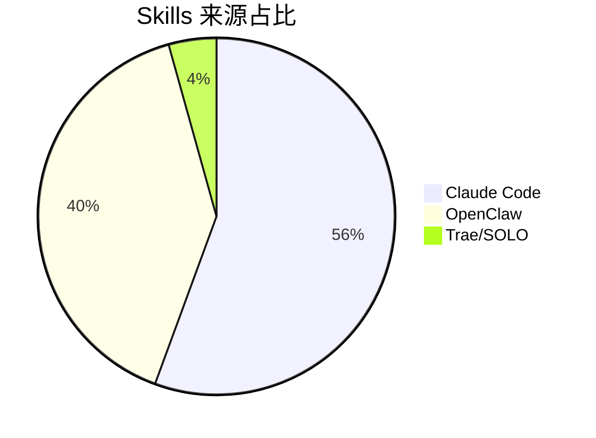
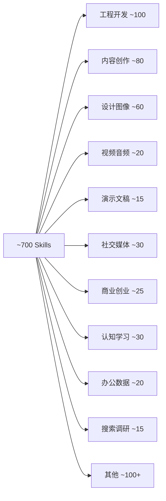

# 本地 Skills 全量统计

> [!info] 统计日期
> 2026-05-10，覆盖 Claude Code、OpenClaw、Trae/SOLO 三大来源

## 总览

| 指标 | 数量 |
|:-----|:-----|
| **总 Skills（去重估算）** | **~700 个** |
| **SKILL.md 文件总数** | **~800+ 个** |
| **来源数量** | **3 大来源** |

---

## 一、来源分布

| 来源 | Skills 数量 | 占比 |
|:-----|:-----------|:-----|
| Claude Code (`~/.claude/`) | ~437 个 | 56% |
| OpenClaw (`.openclaw/` + `openclaw-npm-backup/`) | ~315 个 | 40% |
| Trae/SOLO 内置 (`.trae-cn/`) | ~34 个 | 4% |

---

## 二、GitHub 高星仓库来源

> [!tip] 5000+ Stars 的仓库
> 以下 3 个高星仓库贡献了约 ==268 个== Skills，占总量的 ~40%

| 仓库 | ⭐ Stars | Skills 数量 | 本地路径 |
|:-----|:--------|:-----------|:---------|
| [mattpocock/skills](https://github.com/mattpocock/skills) | 37,000+ | ~23 个 | `.claude/projects/mattpocock-skills/` |
| [nexu-io/open-design](https://github.com/nexu-io/open-design) | 15,000+ | ~65 个 | `.claude/skills/open-design/` |
| [alirezarezvani/claude-skills](https://github.com/alirezarezvani/claude-skills) | 5,200+ | ~180 个 | `.claude/skills/alirezarezvani/` |

---

## 三、Claude Code Skills（~437 个）

### 3.1 顶层独立技能（152 个）

#### 🔧 工程开发类

| 技能名 | 说明 |
|:-------|:-----|
| agent-designer | 多智能体系统设计 |
| agent-workflow-designer | Agent 工作流设计器 |
| api-design-reviewer | API 设计审查 |
| api-test-suite-builder | API 测试套件构建 |
| browser-automation | 浏览器自动化 |
| ci-cd-pipeline-builder | CI/CD 流水线构建 |
| codebase-onboarding | 代码库入职引导 |
| database-designer | 数据库设计器 |
| database-schema-designer | 数据库 Schema 设计器 |
| dependency-auditor | 依赖审计 |
| diagnose | 诊断循环 |
| engineering-advanced-skills | 25 个高级工程技能合集 |
| env-secrets-manager | 环境变量与密钥管理 |
| focused-fix | 深度修复特定功能 |
| git-worktree-manager | Git Worktree 管理 |
| grill-with-docs | 基于文档压力测试方案 |
| improve-codebase-architecture | 代码架构改进 |
| mcp-server-builder | MCP 服务器构建器 |
| migration-architect | 零停机迁移规划 |
| monorepo-navigator | Monorepo 导航 |
| observability-designer | 可观测性策略设计 |
| performance-profiler | 性能分析器 |
| pr-review-expert | PR 代码审查 |
| rag-architect | RAG 管道设计 |
| release-manager | 发布管理 |
| runbook-generator | 运维手册生成器 |
| secrets-vault-manager | 密钥保险库管理 |
| skill-security-auditor | 技能安全审计 |
| skill-tester | 技能测试器 |
| spec-driven-workflow | 规范驱动开发 |
| sql-database-assistant | SQL 查询与优化 |
| tdd | 测试驱动开发 |
| tech-debt-tracker | 技术债务跟踪 |
| website-clone | 网站克隆为 Next.js 项目 |

#### 📋 项目管理类

| 技能名 | 说明 |
|:-------|:-----|
| archive | 归档会话学习与调试方案 |
| command-guide | Claude Code 命令选择指南 |
| planning-with-files | 基于文件的规划 |
| task-harness | 结构化任务管理系统 |
| tc-tracker | 技术变更跟踪器 |
| to-issues | 计划拆分为 Issue |
| to-prd | 对话上下文转 PRD |
| triage | Issue 分类工作流 |
| zoom-out | 放大视角提供宏观上下文 |

#### ✍️ 内容创作类

| 技能名 | 说明 |
|:-------|:-----|
| canghe-format-markdown | Markdown 格式化 |
| canghe-markdown-to-html | Markdown 转 HTML |
| changelog-generator | 变更日志生成器 |
| create-soul | 从零创建 AI 人物 |
| humanizer | 去除 AI 痕迹 |
| translate-book | 多语言书籍翻译 |
| tacit-mining | 隐性知识挖掘 |

#### 🎨 设计/图像类

| 技能名 | 说明 |
|:-------|:-----|
| any2html | 甲子渡口图文排版 |
| banner-creator | Banner 创建器 |
| book-illustration-workflow | 书籍插画工作流 |
| canghe-image-gen | AI 图像生成 |
| canghe-comic | 知识漫画创作 |
| canghe-infographic | 专业信息图生成 |
| canghe-cover-image | 文章封面图生成 |
| canghe-compress-image | 图片压缩 |
| canghe-article-illustrator | 文章配图插画 |
| canghe-danger-gemini-web | Gemini Web API 客户端 |
| logo-creator | Logo 创建器 |
| manga-drama | 漫剧生成器 |
| manga-style-video | 漫画风格视频生成 |
| nanobanana | Gemini 3 Pro 图像生成 |
| open-design | 开源设计工具（69 子技能） |
| prototype | 构建可丢弃原型 |
| qiaomu-info-card-designer | 乔木信息卡设计 |

#### 📹 视频/音频类

| 技能名 | 说明 |
|:-------|:-----|
| seedance-video | Seedance 视频生成 |
| douyin-downloader | 抖音无水印下载 |

#### 📱 社交媒体类

| 技能名 | 说明 |
|:-------|:-----|
| canghe-post-to-wechat | 发布到微信公众号 |
| canghe-post-to-x | 发布到 X (Twitter) |
| canghe-danger-x-to-markdown | X 推文转 Markdown |
| twitter | Twitter/X 内容获取 |
| twitter-monitor | Twitter 账号监控 |
| reddit | Reddit 内容获取 |
| producthunt | Product Hunt 内容获取 |

#### 💼 商业/创业类

| 技能名 | 说明 |
|:-------|:-----|
| company-values | 公司价值观定义 |
| domain-hunter | 域名搜索与比价 |
| find-community | 社区识别与评估 |
| first-customers | 前 100 客户获取策略 |
| grow-sustainably | 可持续增长评估 |
| marketing-plan | 极简主义营销计划 |
| minimalist-review | 商业决策审查 |
| mvp | 最小可行产品构建 |
| pricing | 定价策略 |
| processize | 产品想法转流程 |
| validate-idea | 商业想法验证 |
| reshape-your-life | 人生重新规划 |

#### 📊 数据/办公类

| 技能名 | 说明 |
|:-------|:-----|
| csv-data-summarizer | CSV 分析与可视化 |
| defuddle | 网页干净内容提取 |

#### 🔍 搜索/调研类

| 技能名 | 说明 |
|:-------|:-----|
| requesthunt | 用户需求研究 |
| seo-geo | SEO/GEO 优化 |

#### 🗂️ Obsidian 类

| 技能名 | 说明 |
|:-------|:-----|
| obsidian-bases | Obsidian Bases 创建 |
| obsidian-cli | Obsidian CLI 交互 |
| obsidian-markdown | Obsidian Markdown 编辑 |
| json-canvas | JSON Canvas 文件编辑 |

#### 🔐 其他

| 技能名 | 说明 |
|:-------|:-----|
| caveman | 超压缩通信模式 |
| full-page-screenshot | 完整网页截图 |
| grill-me | 深度追问直到共识 |
| interview-system-designer | 面试系统设计 |
| self-eval | AI 工作质量自评 |
| write-a-skill | 创建新技能 |
| hv-analysis | 横纵分析法深度研究 |

---

### 3.2 华叔/花生系列（22 个）

> [!note] huashu-*

| 技能名 | 说明 |
|:-------|:-----|
| huashu-agent-swarm | 多 Agent 蜂群并行协作 |
| huashu-article-edit | 标准化文章编辑流程 |
| huashu-article-to-x | 长文浓缩为 X 平台内容 |
| huashu-data-pro | 数据分析与办公提效 |
| huashu-design | 设计哲学顾问 |
| huashu-douyin-script | 抖音爆款脚本创作 |
| huashu-image-upload | 配图生成并上传图床 |
| huashu-info-search | 多渠道搜索存知识库 |
| huashu-material-search | 个人素材库搜索 |
| huashu-md-to-pdf | Markdown 转 PDF 白皮书 |
| huashu-prompt-save | Prompt 分类保存 |
| huashu-proofreading | 三遍审校降 AI 检测率 |
| huashu-research | 结构化网络调研 |
| huashu-script-polish | 脚本口语化润色 |
| huashu-slides | 端到端 PPTX 制作 |
| huashu-speech-coach | 演讲教练 |
| huashu-topic-gen | 选题方向生成 |
| huashu-video-check | 视频标题/封面检查 |
| huashu-video-outline | 视频大纲方案生成 |
| huashu-wechat-image | 公众号配图生成 |
| huashu-xhs-image | 小红书配图生成 |

---

### 3.3 LJG 系列（20 个）

> [!note] ljg-*

| 技能名 | 说明 |
|:-------|:-----|
| ljg-card | 内容铸造为 PNG 卡片（7 种模具） |
| ljg-invest | 深度投资分析报告 |
| ljg-learn | 8 维度概念解剖 |
| ljg-paper | 非学术向论文阅读器 |
| ljg-paper-flow | 读论文 + 铸卡片一条龙 |
| ljg-paper-river | 论文倒读法溯源 |
| ljg-plain | 白话改写（12 岁能懂） |
| ljg-present | Outline 层级视觉化呈现 |
| ljg-push | 同步 ljg-* skills 到 GitHub |
| ljg-qa | 核心观点抽成 Q-A 对 |
| ljg-rank | 领域降秩找生成器 |
| ljg-read | 阅读伴侣（翻译+注解） |
| ljg-relationship | 关系分析（结构+精神分析） |
| ljg-roundtable | 结构化圆桌讨论 |
| ljg-skill-map | 技能地图可视化 |
| ljg-think | 纵向深钻思维工具 |
| ljg-travel | 深度旅行研究 |
| ljg-word | 英语单词深度掌握 |
| ljg-word-flow | 解词 + 铸信息图 |
| ljg-writes | 写作引擎（1000-1500 字） |

---

### 3.4 alirezarezvani 超级仓库（~242 个嵌套技能）

> [!abstract] alirezarezvani/claude-skills — 5,200+ ⭐
> 路径：`~/.claude/skills/alirezarezvani/`
> 2,525 文件 / 1,168 目录 / 542 技能目录 / 332 Python 工具 / 451 参考指南

#### 🏢 C-Suite 高管顾问（28+6 个）

> [!info] 路径：`c-level-advisor/skills/` + `c-level-advisor/executive-mentor/skills/`

| 技能名 | 说明 |
|:-------|:-----|
| agent-protocol | C 级高管智能体团队的智能体间通信协议，定义调用语法、循环防止、隔离规则 |
| board-deck-builder | 整合所有 C 级角色视角，组装董事会和投资者更新演示文稿 |
| board-meeting | 多智能体董事会会议协议，运行结构化 6 阶段审议流程 |
| c-level-skills | 10 个 C 级顾问技能插件（CEO/CTO/COO/CPO/CMO/CFO/CRO/CISO/CHRO） |
| ceo-advisor | 行政领导指导——战略决策、组织发展和利益相关者管理 |
| cfo-advisor | 财务领导力——财务建模、单位经济学、融资策略、现金管理 |
| change-management | 有序推进组织变革——ADKAR 模型、沟通模板、阻力应对 |
| chief-of-staff | C 级高管协调层，将创始人问题路由到正确顾问角色 |
| chro-advisor | 人员领导力——招聘策略、薪酬设计、组织架构、文化和留任 |
| ciso-advisor | 安全领导力——风险量化、合规路线图（SOC 2/ISO 27001/HIPAA/GDPR） |
| cmo-advisor | 营销领导力——品牌定位、增长模型设计、营销预算分配 |
| company-os | 公司运营元框架——EOS、Scaling Up、OKR 等运营系统选择 |
| competitive-intel | 系统化竞争对手跟踪，为 CMO/CRO/CPO 决策提供信息 |
| context-engine | 为所有 C 级顾问技能加载和管理公司上下文 |
| coo-advisor | 运营领导力——流程设计、OKR 执行、运营节奏和扩展手册 |
| cpo-advisor | 产品领导力——产品愿景、组合策略、产品市场契合度 |
| cro-advisor | 收入领导力——收入预测、销售模型设计、定价策略、净收入留存 |
| cs-onboard | 创始人入职访谈，跨 7 个维度捕获公司上下文 |
| cto-advisor | 技术领导力——工程团队、架构决策和技术战略 |
| culture-architect | 构建和演进公司文化作为运营行为 |
| decision-logger | 董事会决策的两层记忆架构 |
| founder-coach | 创始人个人领导力发展——创始人原型识别、授权框架 |
| internal-narrative | 在员工、投资者、客户等受众间构建连贯公司故事 |
| intl-expansion | 国际市场扩张——市场选择、进入模式、本地化、合规 |
| ma-playbook | M&A 战略——尽职调查、估值、整合和交易结构 |
| org-health-diagnostic | 跨职能组织健康检查 |
| scenario-war-room | 跨职能假设建模 |
| strategic-alignment | 战略从董事会层叠到个人贡献者 |
| executive-mentor | 创始人/高管对抗性思维伙伴——压力测试、董事会准备 |
| board-prep | 董事会会议准备 |
| challenge | 事前计划分析（Pre-Mortem） |
| hard-call | 没有好选项时的决策框架 |
| postmortem | 对出了什么问题的诚实分析 |
| stress-test | 商业假设压力测试 |

#### 👷 工程核心（37 个）

> [!info] 路径：`engineering/skills/`

| 技能名 | 说明 |
|:-------|:-----|
| agent-designer | 设计多智能体系统、创建智能体架构、定义通信模式 |
| agent-workflow-designer | 智能体工作流设计器 |
| api-design-reviewer | API 设计审查器 |
| api-test-suite-builder | 生成 API 测试、创建集成测试套件 |
| browser-automation | 自动化浏览器任务、抓取网站、填写表单、截图 |
| changelog-generator | 变更日志生成器 |
| ci-cd-pipeline-builder | CI/CD 管道构建器 |
| codebase-onboarding | 代码库入职引导 |
| command-guide | 命令指南 |
| database-designer | 设计数据库模式、规划数据迁移、优化查询 |
| database-schema-designer | 创建 ERD 图、规范化数据库模式 |
| dependency-auditor | 依赖审计器 |
| env-secrets-manager | 环境和密钥管理器 |
| focused-fix | 修复、调试或使特定功能端到端工作 |
| full-page-screenshot | 捕获网页完整页面截图 |
| git-worktree-manager | Git Worktree 管理器 |
| interview-system-designer | 设计面试流程、创建招聘管道 |
| mcp-server-builder | MCP 服务器构建器 |
| migration-architect | 迁移架构师 |
| monorepo-navigator | Monorepo 导航器 |
| observability-designer | 可观测性设计器 |
| performance-profiler | 性能分析器 |
| pr-review-expert | 审查 PR、分析代码变更、检查安全问题 |
| rag-architect | 设计 RAG 管道、优化检索策略、实现向量搜索 |
| release-manager | 规划发布、管理变更日志、协调部署 |
| runbook-generator | 运维手册生成器 |
| secrets-vault-manager | 密钥管理基础设施、HashiCorp Vault 集成 |
| self-eval | 双轴评分系统诚实评估 AI 工作质量 |
| skill-security-auditor | 技能安全审计器 |
| skill-tester | 技能测试器 |
| spec-driven-workflow | 编码前编写规范、定义验收标准 |
| sql-database-assistant | 编写 SQL 查询、优化数据库性能 |
| tc-tracker | 跟踪技术变更、管理 TC 生命周期 |
| tech-debt-tracker | 扫描技术债务、评分严重性、生成修复计划 |
| engineering-advanced-skills | 25 个高级工程技能合集 |

#### 🤖 工程：Agent 超级技能（15 个）

> [!info] 路径：`engineering/agenthub/skills/` + `engineering/autoresearch-agent/skills/` + `engineering/llm-wiki/skills/`

| 技能名 | 路径 | 说明 |
|:-------|:-----|:-----|
| agenthub | agenthub/ | 多智能体协作插件，通过 git worktree 隔离生成 N 个并行子智能体竞争同一任务 |
| board | agenthub/ | 读取/写入/浏览 AgentHub 消息板用于智能体协调 |
| eval | agenthub/ | 通过指标或 LLM 评判评估和排名智能体结果 |
| init | agenthub/ | 创建新的 AgentHub 协作会话 |
| merge | agenthub/ | 将获胜智能体分支合并到基础分支 |
| run | agenthub/ | 一次性生命周期命令：init→baseline→spawn→eval→merge |
| spawn | agenthub/ | 在隔离 git worktree 中启动 N 个并行子智能体 |
| status | agenthub/ | 显示 AgentHub 会话的 DAG 状态和智能体进度 |
| autoresearch-agent | autoresearch-agent/ | 自主实验循环，通过可衡量指标优化任何文件 |
| loop | autoresearch-agent/ | 以用户选择的间隔启动自主实验循环 |
| resume | autoresearch-agent/ | 恢复暂停的实验 |
| run | autoresearch-agent/ | 运行单次实验迭代 |
| setup | autoresearch-agent/ | 交互式设置新的 autoresearch 实验 |
| llm-wiki | llm-wiki/ | 构建或维护 Obsidian 中的持久个人知识库（第二大脑） |

#### 🔬 工程其他子目录（11 个）

> [!info] 路径：`engineering/` 下各独立子目录

| 技能名 | 说明 |
|:-------|:-----|
| behuman | 减少机器感、减少列表感，让 AI 响应更像人类 |
| code-tour | 创建 CodeTour .tour 文件——面向角色的逐步演练 |
| data-quality-auditor | 审计数据集的完整性、一致性、准确性和有效性 |
| demo-video | 创建演示视频、产品演练、功能展示 |
| docker-development | Dockerfile 优化、docker-compose 编排、多阶段构建 |
| helm-chart-builder | Helm chart 开发——chart 脚手架、values 设计 |
| karpathy-coder | 执行 Karpathy 的 4 个编码原则——声明假设、保持简单、使可测试 |
| llm-cost-optimizer | LLM API 成本优化——模型选择、token 优化、缓存策略 |
| prompt-governance | 大规模生产环境中的提示管理——版本控制、A/B 测试 |
| statistical-analyst | 运行假设检验、分析 A/B 实验结果、计算样本大小 |
| terraform-patterns | Terraform IaC——模块设计模式、状态管理 |

#### 🛡️ 高级工程（33 个）

> [!info] 路径：`engineering-team/skills/`

| 技能名 | 说明 |
|:-------|:-----|
| adversarial-reviewer | 对抗性代码审查，打破自我审查的单一文化 |
| ai-security | 评估 AI/ML 系统的提示注入、越狱漏洞、数据中毒等安全风险 |
| aws-solution-architect | 使用无服务器模式和 IaC 模板为初创公司设计 AWS 架构 |
| azure-cloud-architect | 为初创公司和企业设计 Azure 架构 |
| cloud-security | 评估云基础设施安全配置错误、IAM 提权路径 |
| code-reviewer | TypeScript/JavaScript/Python/Go/Swift/Kotlin 代码审查自动化 |
| email-template-builder | 邮件模板构建器 |
| engineering-skills | 23 个工程智能体技能和插件合集 |
| epic-design | Epic 设计 |
| gcp-cloud-architect | 为初创公司和企业设计 GCP 架构 |
| incident-commander | 事件指挥官技能 |
| incident-response | 安全事件分类、分流、升级路径确定和取证证据收集 |
| ms365-tenant-manager | 面向全局管理员的 Microsoft 365 租户管理 |
| red-team | 规划或执行授权红队演练、攻击路径分析 |
| security-pen-testing | 执行安全审计、渗透测试、漏洞扫描、OWASP Top 10 检查 |
| senior-architect | 设计系统架构、评估微服务与单体架构 |
| senior-backend | 设计后端系统——REST API、微服务、数据库架构、认证流程 |
| senior-computer-vision | 计算机视觉——目标检测、图像分割、视觉 AI 系统 |
| senior-data-engineer | 数据工程——构建可扩展数据管道、ETL/ELT 系统 |
| senior-data-scientist | 高级数据科学家——统计建模、实验设计、因果推断 |
| senior-devops | 综合 DevOps——CI/CD、基础设施自动化、容器化、云平台 |
| senior-frontend | 前端开发——React、Next.js、TypeScript、Tailwind CSS |
| senior-fullstack | 全栈开发——Next.js、FastAPI、MERN、Django |
| senior-ml-engineer | ML 工程——模型生产化、MLOps 管道、LLM 集成 |
| senior-prompt-engineer | 提示优化、模板设计、LLM 输出评估、智能体系统构建 |
| senior-qa | 生成单元测试、集成测试和 E2E 测试 |
| senior-secops | 高级 SecOps——应用安全、漏洞管理、合规验证 |
| senior-security | 安全工程——威胁建模、漏洞分析、安全架构、渗透测试 |
| stripe-integration-expert | Stripe 集成专家 |
| tdd-guide | 测试驱动开发——编写单元测试、生成测试夹具 |
| tech-stack-evaluator | 技术栈评估和比较——TCO 分析、安全评估 |
| threat-detection | 搜索威胁、分析 IOC 或检测遥测中的行为异常 |

#### 🧪 Playwright Pro（10 个）

> [!info] 路径：`engineering-team/playwright-pro/skills/`

| 技能名 | 说明 |
|:-------|:-----|
| pw | 生产级 Playwright 测试工具包——E2E 测试、浏览器自动化 |
| init | 在项目中设置 Playwright |
| generate | 从用户故事/URL/组件名称生成 Playwright 测试 |
| fix | 诊断和修复失败或不稳定的 Playwright 测试 |
| coverage | 分析测试覆盖率差距 |
| migrate | 从 Cypress 或 Selenium 迁移到 Playwright |
| report | 生成测试报告 |
| review | 审查 Playwright 测试文件的反模式和最佳实践 |
| browserstack | 在 BrowserStack 云网格上运行跨浏览器测试 |
| testrail | Playwright 测试与 TestRail 双向同步 |

#### 🧠 自我改进 Agent（6 个）

> [!info] 路径：`engineering-team/self-improving-agent/skills/`

| 技能名 | 说明 |
|:-------|:-----|
| self-improving-agent | 将 Claude Code 的自动记忆策展为持久项目知识 |
| extract | 将验证过的模式转化为独立可复用技能 |
| promote | 将模式从自动记忆升级到 CLAUDE.md 或 .claude/rules/ |
| remember | 显式保存重要知识到自动记忆 |
| review | 分析自动记忆的推广候选和过期条目 |
| status | 记忆健康仪表板——行数、主题文件、容量 |

#### 🔧 工程团队其他（3 个）

| 技能名 | 路径 | 说明 |
|:-------|:-----|:-----|
| snowflake-development | snowflake-development/ | Snowflake SQL、数据管道、Cortex AI 和 Snowpark Python |
| google-workspace-cli | google-workspace-cli/ | 通过 gws CLI 管理 Google Workspace |
| a11y-audit | a11y-audit/ | WCAG 2.2 无障碍审计和修复 |

#### 📈 市场营销（42+1 个）

> [!info] 路径：`marketing-skill/skills/` + `marketing-skill/video-content-strategist/skills/`

| 技能名 | 说明 |
|:-------|:-----|
| ab-test-setup | 规划、设计或实施 A/B 测试或实验 |
| ad-creative | 为付费广告生成、迭代或扩展广告创意 |
| ai-seo | 优化内容以被 AI 搜索引擎引用（ChatGPT/Perplexity/Google AI Overviews） |
| analytics-tracking | 设置、审计和调试分析跟踪（GA4/GTM/事件分类） |
| app-store-optimization | App Store Optimization (ASO) 工具包 |
| brand-guidelines | 应用、记录或执行品牌指南 |
| campaign-analytics | 多触点归因、漏斗转化分析和 ROI 计算 |
| churn-prevention | 取消流程设计、挽留优惠、退出调查、催款序列 |
| cold-email | 编写 B2B 冷外联邮件序列 |
| competitor-alternatives | 创建竞争对手比较或替代页面 |
| content-creator | (已弃用) 路由到正确的专家技能 |
| content-humanizer | 使 AI 内容听起来真正像人类 |
| content-production | 完整内容生产管道——从空白页到发布就绪 |
| content-strategy | 规划内容策略 |
| copy-editing | 编辑、审查或改进营销文案 |
| copywriting | 编写、重写或改进营销文案 |
| email-sequence | 创建或优化邮件序列、滴灌活动 |
| form-cro | 优化非注册/登录表单的转化率 |
| free-tool-strategy | 为营销构建免费工具——潜在客户开发/SEO/品牌意识 |
| launch-strategy | 规划产品发布、功能公告或发布策略 |
| marketing-context | 创建和维护所有营销技能读取的营销上下文文档 |
| marketing-demand-acquisition | 创建需求生成活动、优化付费广告、开发 SEO 策略 |
| marketing-ideas | 为 SaaS 或软件产品提供营销创意和策略 |
| marketing-ops | 营销技能生态系统的中央路由器 |
| marketing-psychology | 将心理学原理和心智模型应用于营销 |
| marketing-skills | 42 个营销智能体技能和插件合集 |
| marketing-strategy-pmm | 产品营销——定位、GTM 策略、竞争情报 |
| onboarding-cro | 优化注册后入职引导、用户激活、首次运行体验 |
| page-cro | 优化营销页面的转化率 |
| paid-ads | Google Ads/Meta/LinkedIn/Twitter/X 付费广告活动 |
| paywall-upgrade-cro | 创建或优化应用内付费墙、升级屏幕 |
| popup-cro | 创建或优化弹窗、模态框、覆盖层以提高转化 |
| pricing-strategy | 设计 SaaS 定价——层级结构、价值指标、价格上涨策略 |
| programmatic-seo | 使用模板和数据大规模创建 SEO 驱动页面 |
| prompt-engineer-toolkit | 分析和重写提示以获得更好 AI 输出 |
| referral-program | 设计、启动或优化推荐或联盟计划 |
| schema-markup | 实施、审计或验证结构化数据 |
| seo-audit | 审计、审查或诊断网站的 SEO 问题 |
| signup-flow-cro | 优化注册、注册、账户创建或试用激活流程 |
| site-architecture | 审计、重新设计或规划网站结构 |
| social-content | 为 LinkedIn/Twitter/Instagram/TikTok 创建社交媒体内容 |
| social-media-analyzer | 社交媒体活动分析和性能跟踪 |
| social-media-manager | 社交媒体策略、内容日历、社区参与 |
| x-twitter-growth | X/Twitter 增长引擎——建立受众、制作病毒式内容 |
| video-content-strategist | 规划视频内容策略、编写脚本、优化 YouTube、构建短视频管道 |

#### 📦 产品团队（14+4 个）

> [!info] 路径：`product-team/skills/` + 4 个嵌套子目录

| 技能名 | 路径 | 说明 |
|:-------|:-----|:-----|
| competitive-teardown | skills/ | 综合定价页面、评论、招聘信息、SEO 信号分析竞争对手 |
| experiment-designer | skills/ | 规划产品实验、编写可测试假设、估计样本量 |
| landing-page-generator | skills/ | 生成高转化落地页（Next.js/React + Tailwind CSS） |
| product-analytics | skills/ | 定义产品 KPI、构建指标仪表板 |
| product-discovery | skills/ | 验证产品机会、映射假设、规划发现冲刺 |
| product-manager-toolkit | skills/ | PM 综合工具包——RICE 优先排序、客户访谈、PRD 模板 |
| product-skills | skills/ | 10 个产品智能体技能和插件合集 |
| product-strategist | skills/ | 战略产品领导力——OKR 级联、季度规划、竞争分析 |
| roadmap-communicator | skills/ | 准备路线图叙述、发布说明、变更日志 |
| saas-scaffolder | skills/ | 生成完整生产就绪的 SaaS 项目样板 |
| spec-to-repo | skills/ | 将自然语言项目规范转化为可运行代码仓库 |
| ui-design-system | skills/ | UI 设计系统工具包——设计令牌生成、组件文档 |
| ux-researcher-designer | skills/ | UX 研究和设计工具包 |
| research-summarizer | research-summarizer/ | 结构化研究摘要——处理论文/文章/报告 |
| code-to-prd | code-to-prd/ | 将代码库逆向工程为完整 PRD |
| apple-hig-expert | apple-hig-expert/ | Apple HIG 专家指导（iOS/macOS/visionOS） |
| agile-product-owner | agile-product-owner/ | 敏捷产品所有权——用户故事、验收标准、冲刺规划 |

#### 💰 财务（3+1 个）

> [!info] 路径：`finance/skills/` + `finance/business-investment-advisor/skills/`

| 技能名 | 说明 |
|:-------|:-----|
| finance-skills | 财务分析师技能合集——比率分析、DCF 估值、预算差异 |
| financial-analyst | 执行财务比率分析、DCF 估值、滚动预测构建 |
| saas-metrics-coach | SaaS 财务健康顾问——ARR/MRR/流失/LTV/CAC |
| business-investment-advisor | 商业投资分析和资本配置顾问 |

#### 📈 商业增长（5 个）

> [!info] 路径：`business-growth/skills/`

| 技能名 | 说明 |
|:-------|:-----|
| business-growth-skills | 4 个业务增长技能合集 |
| contract-and-proposal-writer | 合同和提案撰写器 |
| customer-success-manager | 客户健康监控、流失风险预测、扩展机会识别 |
| revenue-operations | 销售管道健康、收入预测准确性、GTM 效率 |
| sales-engineer | RFP/RFI 响应覆盖差距分析、竞争功能比较、POC 规划 |

#### 📋 项目管理（9 个）

> [!info] 路径：`project-management/skills/`

| 技能名 | 说明 |
|:-------|:-----|
| atlassian-admin | Atlassian 管理员——Jira/Confluence/Bitbucket/Trello |
| atlassian-templates | Atlassian 模板和文件创建/修改 |
| confluence-expert | Confluence 专家——空间/知识库/文档管理 |
| jira-expert | Jira 专家——项目/规划/JQL 查询/工作流 |
| meeting-analyzer | 分析会议记录，提取行为模式和教练反馈 |
| pm-skills | 6 个项目管理技能合集 |
| scrum-master | 数据驱动敏捷团队的高级 Scrum Master |
| senior-pm | 面向企业软件/SaaS/数字化转型的高级项目经理 |
| team-communications | 撰写内部公司沟通——3P 更新/公司通讯/事件报告 |

#### 🏥 法规事务与质量管理（14 个）

> [!info] 路径：`ra-qm-team/skills/`

| 技能名 | 说明 |
|:-------|:-----|
| ra-qm-skills | 12 个监管和质量管理技能合集 |
| capa-officer | 医疗器械 QMS 的 CAPA 系统管理 |
| fda-consultant-specialist | FDA 监管顾问——510(k)/PMA/De Novo 路径指导 |
| gdpr-dsgvo-expert | GDPR/DSGVO 合规自动化——隐私风险扫描、DPIA 文档 |
| information-security-manager-iso27001 | ISO 27001 ISMS 实施和网络安全治理 |
| isms-audit-expert | ISO 27001 合规验证的 ISMS 审计 |
| mdr-745-specialist | EU MDR 2017/745 合规——医疗器械分类/技术文档 |
| qms-audit-expert | 医疗器械 QMS 的 ISO 13485 内部审计 |
| quality-documentation-manager | 医疗器械 QMS 的文件控制系统管理 |
| quality-manager-qmr | 高级质量管理者代表 (QMR) |
| quality-manager-qms-iso13485 | ISO 13485 质量管理体系实施和维护 |
| regulatory-affairs-head | 高级法规事务经理 |
| risk-management-specialist | ISO 14971 医疗器械风险管理 |
| soc2-compliance | SOC 2 审计准备、信任服务标准映射、控制矩阵构建 |

---

### 3.5 open-design 设计库（65 个嵌套技能）

> [!abstract] nexu-io/open-design — 15,000+ ⭐
> 路径：`~/.claude/skills/open-design/skills/`

#### 🖥️ 网页原型类

| 技能名 | 说明 |
|:-------|:-----|
| web-prototype | 通用桌面网页原型，单文件 HTML，基于模板种子 + 布局参考库 |
| web-prototype-taste-soft | Apple 风格柔和网页原型——银白画布、双框卡片、圆角、弹簧动效 |
| web-prototype-taste-editorial | 编辑极简主义网页原型——暖色单色画布、衬线标题、细线边框 |
| web-prototype-taste-brutalist | 瑞士工业印刷风网页原型——新闻纸画布、黑色粗体、危险红点缀 |
| mobile-app | 移动应用屏幕——像素级 iPhone 15 Pro 框架内渲染 |
| mobile-onboarding | 移动端引导流程——三屏手机框架并排 |
| saas-landing | SaaS 产品落地页——Hero/功能/社会证明/定价/CTA |
| pricing-page | 独立定价页——方案层级、功能对比表、FAQ |
| docs-page | 文档页面——内联导航 + 可滚动正文 + 侧边目录 |
| dashboard | 管理/分析仪表盘——固定左侧栏 + KPI 卡片 + 图表 |
| dating-web | 社交/约会仪表盘——左侧导航/社区信号/匹配趋势 |
| kanban-board | 看板/任务板——列（待办/进行中/审核/完成）、卡片、泳道 |
| live-artifact | 可刷新、可审计的数据驱动产物（实时仪表盘/同步视图） |

#### 🎨 幻灯片/Deck 类

| 技能名 | 说明 |
|:-------|:-----|
| simple-deck | 单文件横向滑动 HTML 幻灯片 |
| replit-deck | Replit Slides 风格——8 套主题（helix/holm/vance 等） |
| open-design-landing-deck | Atelier Zero 品牌幻灯片——暖纸背景、衬线强调 |
| kami-deck | 纸（kami）风格幻灯片——暖羊皮纸背景、墨蓝点缀 |
| guizang-ppt | 电子杂志 × 电子墨水风格横向翻页网页 PPT（WebGL 流体背景） |
| html-ppt | HTML PPT Studio——多风格/布局/动画的专业静态 HTML 演示文稿 |
| html-ppt-xhs-white-editorial | 白底杂志风 deck——纯白背景 + 彩虹 bar + 渐变文字 |
| html-ppt-xhs-post | 小红书/Instagram 风 9 页 3:4 竖版图文（810x1080） |
| html-ppt-xhs-pastel-card | 柔和马卡龙慢生活 deck——奶油底 + 柔光 blob |
| html-ppt-weekly-report | 团队周报/状态更新 deck——企业风格、KPI 网格 |
| html-ppt-testing-safety-alert | 红琥珀警示 deck——红黑危险条纹、L1/L2/L3 分级 |
| html-ppt-tech-sharing | 会议/内部技术分享 deck——GitHub 暗色主题 |
| html-ppt-taste-editorial | 编辑极简主义 16:9 HTML deck——暖奶油幻灯片 |
| html-ppt-taste-brutalist | 战术遥测/CRT 终端风 16:9 HTML deck——暗炭色幻灯片 |
| html-ppt-product-launch | 产品发布 Keynote deck——暗色 Hero + 浅色内容 |
| html-ppt-presenter-mode-reveal | 演讲者模式专用 deck——5 套主题切换、逐字稿、提词器 |
| html-ppt-pitch-deck | 投资人 10 页融资 deck——白色 + 蓝紫渐变 Hero |
| html-ppt-obsidian-claude-gradient | GitHub 暗紫渐变 deck——暗色网格、紫蓝环境光 |
| html-ppt-knowledge-arch-blueprint | 奶油蓝图架构 deck——奶油纸底 + 锈红高亮 |
| html-ppt-hermes-cyber-terminal | 暗终端测评 deck——赛博网格 + CRT 暗角 + 扫描线 |
| html-ppt-graphify-dark-graph | 暗底知识图谱 deck——深夜渐变 + 漂浮光球 |
| html-ppt-dir-key-nav-minimal | 8 页极简方向键 keynote——每页独立单色背景 |
| html-ppt-course-module | 在线课程/工作坊模块 deck——暖纸背景 + 衬线 |

#### 📄 文档/页面类

| 技能名 | 说明 |
|:-------|:-----|
| blog-post | 长文/博客文章——报头/英雄图/正文/作者署名 |
| meeting-notes | 会议纪要页——参会者/议程/决策/行动项 |
| weekly-update | 团队周报横向滑动幻灯片 |
| pm-spec | 产品需求文档/PRD 单页 |
| invoice | 可打印发票页 |
| eng-runbook | 工程运维手册——服务概览/告警表/常用操作 |
| finance-report | 季度/月度财务报告——KPI/营收图表/P&L |
| hr-onboarding | 新员工入职计划页 |
| email-marketing | 品牌产品发布邮件——纯 HTML 邮件布局 |
| digital-eguide | 双页数字电子指南预览 |
| design-brief | 解析 I-Lang 协议格式的结构化设计简报 |

#### 🎭 视觉/创意类

| 技能名 | 说明 |
|:-------|:-----|
| wireframe-sketch | 手绘风格线框图——方格纸背景、马克笔/铅笔色调 |
| image-poster | 单图生成——海报/主视觉/编辑插图 |
| magazine-poster | 编辑风海报——新闻纸/大标题/双栏正文 |
| social-carousel | 三卡社交媒体轮播——1080x1080 方形 |
| sprite-animation | 像素风精灵动画解说幻灯片——CSS 关键帧循环 |
| motion-frames | 单帧动态设计合成——CSS 循环动画 |
| hyperframes | HTML 视频合成——标题卡/叠加字幕/音频反应动画 |
| video-shortform | 短视频生成——3-10 秒产品揭晓/动态预告 |
| audio-jingle | 音频生成——广告曲/背景乐/旁白/音效 |
| tweaks | 参数化变体面板——为 HTML 产物包装实时控件 |
| critique | 5 维度专家设计评审（哲学/视觉层级/细节/功能/创新） |
| gamified-app | 游戏化移动应用原型——三屏手机框架 |
| hatch-pet | 创建/修复/验证 Codex 兼容的动画宠物精灵图 |
| team-okrs | OKR 追踪页面——季度横幅、目标+关键结果进度条 |
| open-design-landing | Atelier Zero 编辑拼贴风品牌落地页 |
| kami-landing | 纸（kami）风格单页文档——暖羊皮纸、墨蓝点缀 |
| pptx-html-fidelity-audit | PPTX-HTML 保真度审计 |

---

### 3.6 engineering 嵌套（9 个）

> [!info] 路径：`~/.claude/skills/engineering/`（Matt Pocock 工程技能副本）

| 技能名 | 说明 |
|:-------|:-----|
| zoom-out | 提升抽象层级，给出更宏观的模块地图和调用关系概览 |
| triage | Issue 分诊——通过状态机管理（需评估/等待报告者/就绪/不修复） |
| to-prd | 将当前对话上下文合成为 PRD 并发布到 Issue Tracker |
| to-issues | 将 PRD/功能需求拆分为垂直切片 Issue |
| tdd | 测试驱动开发——垂直切片/示踪子弹式循环 |
| setup-matt-pocock-skills | 配置 Matt Pocock 技能集 |
| improve-codebase-architecture | 改进代码库架构——探索/提出候选/领域词汇对齐 |
| grill-with-docs | 基于文档的深度质询——挑战计划与领域模型 |
| diagnose | Bug 诊断六阶段法——反馈循环/复现/假设/插桩/修复/复盘 |

---

### 3.7 yao 嵌套（9 个）

> [!info] 路径：`~/.claude/skills/yao/`

| 技能名 | 说明 |
|:-------|:-----|
| learning-builder | 创建个性化学习教程——学习者画像 + 权威源研究，输出 docx/pdf |
| yao-tutorial-skill | Yao 教程技能——结构化教程创建工作流 |
| yao-open-skills-sync | Yao 开源技能同步——检查/导入/注册/发布技能到 GitHub |
| yao-kelly-skill | Yao Kelly 技能——基于 Kelly 准则的决策/投注分析 |
| yao-business-skill | Yao 商业技能——商业分析与决策支持 |
| yao-bayesian-skill | Yao 贝叶斯技能——贝叶斯推理与概率分析 |
| skill-doctor | 技能医生——诊断和修复 Claude Code 技能问题 |
| skill-builder | 学习构建器（同 learning-builder） |
| skill-analyzer | 学习构建器（同 learning-builder） |

---

### 3.8 planning-with-files 嵌套（6 个）

> [!info] 路径：`~/.claude/skills/planning-with-files/skills/`

| 技能名 | 说明 |
|:-------|:-----|
| planning-with-files | 文件规划系统——用文本文件管理 Agent 任务的上下文/计划/错误日志 |
| planning-with-files-zh | 文件规划系统（简体中文版） |
| planning-with-files-zht | 檔案規劃系統（繁体中文版） |
| planning-with-files-es | Sistema de Planificación con Archivos（西班牙语版） |
| planning-with-files-de | Dateiplanungssystem（德语版） |
| planning-with-files-ar | نظام تخطيط الملفات（阿拉伯语版） |

---

### 3.9 nature 嵌套（2 个）

> [!info] 路径：`~/.claude/skills/nature/`

| 技能名 | 说明 |
|:-------|:-----|
| nature-figure | Nature/高影响力期刊级别的 matplotlib 出版级图表 |
| nature-polishing | Nature 图表润色 |

---

### 3.10 productivity 嵌套（2 个）

> [!info] 路径：`~/.claude/skills/productivity/`

| 技能名 | 说明 |
|:-------|:-----|
| write-a-skill | 编写 Claude Code 技能——结构/SKILL.md 模板/审查清单 |
| grill-me | 深度质询——逐分支追问设计/计划直到达成共识 |

---

### 3.11 mattpocock-skills Projects（22 个）

> [!info] 路径：`~/.claude/projects/mattpocock-skills-3dae2b1/skills/`

#### deprecated/（4 个）

| 技能名 | 说明 |
|:-------|:-----|
| ubiquitous-language | 提炼项目通用语言——领域词汇表/生命周期/关系 |
| request-refactor-plan | 创建详细重构计划——微提交拆分 + GitHub Issue |
| qa | QA 会话——倾听/探索/评估范围/提交 Issue |
| design-an-interface | 设计接口——需求收集/并行设计生成/对比/综合 |

#### engineering/（9 个）

与 `~/.claude/skills/engineering/` 相同，见 [[#3.6 engineering 嵌套（9 个）]]

#### misc/（4 个）

| 技能名 | 说明 |
|:-------|:-----|
| git-guardrails-claude-code | 设置 Claude Code hooks 阻止危险 git 命令 |
| migrate-to-shoehorn | 将测试从 `as` 类型断言迁移到 @total-typescript/shoehorn |
| scaffold-exercises | 创建练习目录结构（章节/题目/解答/讲解） |
| setup-pre-commit | 设置 Husky pre-commit hooks（Prettier + 类型检查 + 测试） |

#### personal/（2 个）

| 技能名 | 说明 |
|:-------|:-----|
| obsidian-vault | 搜索/创建/管理 Obsidian 笔记库中的笔记 |
| edit-article | 编辑和改进文章——重组章节/提升清晰度/精炼文字 |

#### productivity/（3 个）

与 `~/.claude/skills/productivity/` 相同 + caveman

---

### 3.12 Plugins 技能（~34 个）

#### Caveman 插件（8 个）

> [!info] 路径：`~/.claude/plugins/marketplaces/JuliusBrussee-caveman/`

| 技能名 | 说明 |
|:-------|:-----|
| caveman | 超压缩通信模式——减少 ~75% token，支持 lite/full/ultra/wenyan 强度 |
| caveman-help | Caveman 帮助——模式切换/技能列表/配置默认模式 |
| caveman-stats | 显示当前会话真实 token 用量和节省估算 |
| caveman-review | 超压缩代码评审——每条发现一行：位置/问题/修复 |
| caveman-commit | 超压缩提交信息生成——Conventional Commits 格式 |
| cavecrew | Caveman 子代理决策指南——investigator/builder/reviewer |
| compress | Caveman 压缩——压缩文本/代码注释，保留技术实质 |

#### Claude Plugins Official（26 个）

> [!info] 路径：`~/.claude/plugins/marketplaces/claude-plugins-official/`

| 技能名 | 说明 |
|:-------|:-----|
| skill-creator | 技能创建器——捕获意图/编写 SKILL.md/测试/迭代 |
| session-report | 生成 Claude Code 会话使用报告的 HTML 文件 |
| skill-development | 插件技能开发——解剖/创建/验证/迭代技能 |
| plugin-structure | 插件目录结构/manifest/组件组织指南 |
| plugin-settings | 插件设置模式——YAML frontmatter 配置管理 |
| mcp-integration | MCP 服务器集成——SSE/stdio/HTTP/WebSocket |
| hook-development | Hook 开发——PreToolUse/PostToolUse/Stop 事件驱动 |
| command-development | 斜杠命令开发——YAML frontmatter/动态参数 |
| agent-development | 子代理开发——系统提示/触发条件/工具配置 |
| playground | 交互式 HTML Playground 构建器 |
| build-mcp-server | MCP 服务器开发入口——发现/部署/工具设计 |
| build-mcpb | 构建打包本地 MCP 服务器（MCPB） |
| build-mcp-app | 构建 MCP App（交互式 UI 组件） |
| math-olympiad | 竞赛数学求解器（IMO/Putnam/USAMO/AIME） |
| writing-rules | 编写 Hookify 规则——语法和模式指南 |
| frontend-design | 创建独特的生产级前端界面 |
| example-skill | 示例技能参考模板 |
| example-command | 示例命令演示 |
| claude-md-improver | CLAUDE.md 文件审计和改进 |
| claude-automation-recommender | 分析代码库并推荐 Claude Code 自动化 |
| telegram/configure | Telegram 频道设置 |
| telegram/access | Telegram 频道访问管理 |
| imessage/configure | iMessage 频道设置 |
| imessage/access | iMessage 频道访问管理 |
| discord/configure | Discord 频道设置 |
| discord/access | Discord 频道访问管理 |

---

## 四、OpenClaw Skills（~315 个）

### 4.1 主工作区 workspace（146 个）

> [!tip] 最大的单个 workspace
> 路径：`.openclaw/workspace/skills/`

#### 🎓 学术/研究

| 技能名 | 说明 |
|:-------|:-----|
| academic-deep-research | 学术深度研究 |
| academic-writing | 学术写作 |
| baidu-scholar-search | 百度学术搜索 |
| deep-research-pro | 深度研究 Pro |
| literature-search | 文献搜索 |
| research-proposal | 研究计划书 |
| knowledge-hunter | 知识猎手 |

#### 🤖 AI/自动化

| 技能名 | 说明 |
|:-------|:-----|
| ai-automation-workflows | AI 自动化工作流 |
| ai-ppt-generate | AI PPT 生成 |
| ai-tools | AI 工具集 |
| agent-autonomy-kit | Agent 自主工具包 |
| agent-browser | Agent 浏览器 |
| agent-memory | Agent 记忆 |
| agent-team-orchestration | Agent 团队编排 |
| agentic-coding | Agentic 编码 |
| automation-workflows | 自动化工作流 |
| claw-shell | Claw Shell |
| computer-use | 计算机使用 |
| deepseek-reasoner-lite-agent | DeepSeek 推理精简 Agent |
| multi-agent-trigger | 多 Agent 触发器 |
| n8n-workflow-automation | n8n 工作流自动化 |
| openclaw-auto-updater | OpenClaw 自动更新器 |
| openclaw-doctor-pro | OpenClaw 诊断 Pro |
| openclaw-github-assistant | OpenClaw GitHub 助手 |
| rag | RAG 检索增强生成 |
| task-router | 任务路由器 |

#### 📹 视频/媒体

| 技能名 | 说明 |
|:-------|:-----|
| ai-notes-ofvideo | AI 视频笔记 |
| capcut-editing | CapCut 剪辑 |
| cinematography-guide | 电影摄影指南 |
| douyin-downloader | 抖音下载器 |
| douyin-hot | 抖音热门 |
| douyin-summary | 抖音摘要 |
| douyin-trends | 抖音趋势 |
| douyin-video-download | 抖音视频下载 |
| paper-slide-deck | 论文幻灯片 |
| remotion-best-practices | Remotion 最佳实践 |
| remotion-skills | Remotion 技能 |
| seedance-prompt | Seedance 提示词 |
| video-frames | 视频帧提取 |
| video-shot-analysis | 视频镜头分析 |
| video-subtitles | 视频字幕 |
| video-workflow | 视频工作流 |
| Video-Wrapper-Skills | 视频包装技能 |
| viral-video-hooks | 病毒视频钩子 |
| youtube-summarizer | YouTube 摘要器 |
| youtube-transcript | YouTube 字幕下载 |

#### 📱 社交/内容

| 技能名 | 说明 |
|:-------|:-----|
| ai-news-zh | AI 新闻中文 |
| brainstorming | 头脑风暴 |
| brand-guidelines | 品牌指南 |
| content-strategy | 内容策略 |
| copywriting | 文案撰写 |
| internal-comms | 内部沟通 |
| mia-content-creator | MIA 内容创作者 |
| news-summary | 新闻摘要 |
| pls-copy-editing | PLS 文案编辑 |
| pls-marketing-ideas | PLS 营销创意 |
| podcast | 播客 |
| rss-ai-reader | RSS AI 阅读器 |
| slack | Slack |
| slack-gif-creator | Slack GIF 创建器 |
| smart-learning | 智能学习 |
| social-content | 社交内容 |
| writing | 写作 |
| writing-assistant | 写作助手 |
| x-post-automation | X 帖子自动化 |
| xhs | 小红书 |
| xhs-skill | 小红书技能 |
| xhs_comment_reply | 小红书评论回复 |
| xiaohongshu-writing | 小红书写作 |

#### 🎨 UI/UX/设计

| 技能名 | 说明 |
|:-------|:-----|
| algorithmic-art | 算法艺术 |
| better-icons | 更好的图标 |
| better-icons-fixed | 更好的图标（修复版） |
| blender-mcp | Blender MCP |
| blender-modeling | Blender 建模 |
| canvas-design | 画布设计 |
| frontend-design | 前端设计 |
| impeccable | 无瑕设计 |
| theme-factory | 主题工厂 |
| ui-design-brain | UI 设计大脑 |
| ui-design-brain-fixed | UI 设计大脑（修复版） |
| ui-skills | UI 技能 |
| ui-ux-pro-max | UI/UX Pro Max |

#### 📊 办公/文档

| 技能名 | 说明 |
|:-------|:-----|
| doc-coauthoring | 文档协作 |
| docx | Word 文档处理 |
| docx-reader | Word 文档阅读 |
| edge-tts | Edge TTS 语音合成 |
| email-daily-summary | 邮件每日摘要 |
| feishu-calendar | 飞书日历 |
| mindmap-generator | 思维导图生成器 |
| nano-pdf | Nano PDF |
| pdf | PDF 处理 |
| pdf-generator | PDF 生成器 |
| pdf-parser | PDF 解析器 |
| planning-with-files | 文件规划 |
| pptx | PowerPoint 处理 |
| prompt-engineering-expert | 提示工程专家 |
| prompt-enhancer | 提示增强器 |
| prompt-optimizer | 提示优化器 |
| secucheck | 安全检查 |
| tavily-search | Tavily 搜索 |
| vercel-deploy | Vercel 部署 |
| webapp-testing | Web 应用测试 |
| webhook | Webhook |
| xlsx | Excel 处理 |

#### 💻 开发/工具

| 技能名 | 说明 |
|:-------|:-----|
| browser-js | 浏览器 JS |
| coding | 编码 |
| context-compressor | 上下文压缩器 |
| database-operations | 数据库操作 |
| fastapi | FastAPI |
| langskills-generator | 语言技能生成器 |
| langskills-search | 语言技能搜索 |
| mcp-builder | MCP 构建器 |
| offline-llama | 离线 LLaMA |
| playwright-scraper-skill | Playwright 爬虫技能 |
| py | Python |
| windows-ui-automation | Windows UI 自动化 |

#### 🏃 生活/其他

| 技能名 | 说明 |
|:-------|:-----|
| cooking | 烹饪 |
| fitness | 健身 |
| health | 健康 |
| medical-imaging-review | 医学影像审查 |
| notes | 笔记 |
| productivity | 生产力 |
| ps-tk9-automation | PS TK9 自动化 |
| qveris-official | Qveris 官方 |
| skill-creator | 技能创建器 |
| todo-management | 待办管理 |
| travel | 旅行 |
| weather | 天气 |
| zero-rules | 零规则 |

---

### 4.2 境界 workspace-jingjie（46 个）

> [!info] 路径：`.openclaw/workspace-jingjie/skills/`

#### LJG 系列（14 个）

| 技能名 | 说明 |
|:-------|:-----|
| ljg-card | 内容铸造为 PNG 卡片 |
| ljg-invest | 深度投资分析报告 |
| ljg-learn | 8 维度概念解剖 |
| ljg-paper | 非学术向论文阅读器 |
| ljg-paper-flow | 读论文 + 铸卡片一条龙 |
| ljg-plain | 白话改写 |
| ljg-rank | 领域降秩找生成器 |
| ljg-skill-map | 技能地图可视化 |
| ljg-travel | 深度旅行研究 |
| ljg-word | 英语单词深度掌握 |
| ljg-word-flow | 解词 + 铸信息图 |
| ljg-writes | 写作引擎 |
| ljg-x-download | LJG X 下载 |

#### Impeccable 设计系列（21 个）

| 技能名 | 说明 |
|:-------|:-----|
| adapt | 适配设计以在不同屏幕/设备/平台上工作 |
| animate | 通过有目的的动画和微交互增强体验 |
| arrange | 改善布局、间距和视觉节奏 |
| audit | 对界面质量进行全面审计 |
| bolder | 放大安全或无聊的设计，增加视觉冲击力 |
| clarify | 改善不清晰的 UX 文案和微文案 |
| colorize | 为单色设计添加策略性颜色 |
| critique | 从 UX 角度评估设计效果 |
| delight | 添加愉悦感和个性，让界面令人难忘 |
| distill | 剥离不必要的复杂性，回归本质 |
| extract | 提取可复用组件和设计令牌到设计系统 |
| frontend-design | 创建独特的生产级前端界面 |
| harden | 提升界面韧性——错误处理/i18n/文本溢出 |
| normalize | 规范化设计以匹配设计系统 |
| onboard | 设计或改进引导流程和首次用户体验 |
| optimize | 提升界面性能——加载/渲染/动画/包大小 |
| overdrive | 突破常规限制——着色器/60fps/弹簧物理 |
| polish | 发布前最终质量检查 |
| quieter | 降低过于大胆的设计强度 |
| teach-impeccable | 一次性设置，建立持久设计指南 |
| typeset | 改善排版——字体/层级/大小/粗细一致性 |

#### Taste 设计系列（7 个）

| 技能名 | 说明 |
|:-------|:-----|
| brutalist-skill | 瑞士排版印刷 × 军事终端美学 |
| minimalist-skill | 干净编辑风格——暖色调单色板/排版对比 |
| output-skill | 覆盖默认截断行为，强制完整代码生成 |
| redesign-skill | 将现有网站升级为高端质量 |
| soft-skill | 教 AI 像高端设计机构一样设计 |
| stitch-skill | 面向 Google Stitch 的语义设计系统 |
| taste-skill | 高级 UI/UX 工程师——基于指标的规则 |

#### 其他（4 个）

| 技能名 | 说明 |
|:-------|:-----|
| bb-browser | 将任何网站变成 CLI 命令 |
| bb-browser-claw | Chrome CDP 自动化 |
| better-icons | 更好的图标 |
| ContentAnalysis | 内容分析 |
| Research | 研究 |
| skills-best-practices | 技能最佳实践 |
| ui-design-brain | UI 设计大脑 |

---

### 4.3 其他 Workspace

| Workspace | 数量 | 技能列表 |
|:----------|:-----|:---------|
| 暖居 nuanju | 6 个 | baoyu-post-to-wechat, baoyu-translate, bb-browser, bb-browser-claw, feishu-meeting, research-proposal |
| 马欣 maxin | 1 个 | paper-review-pro |
| 颜值 yanzhi | 2 个 | bb-browser, bb-browser-claw |
| 智学 zhixue | 2 个 | bb-browser, bb-browser-claw |

---

### 4.4 嵌套 Skills 目录（89 个）

#### baoyu-skills（18 个）

> [!info] 路径：`.openclaw/workspace/baoyu-skills/skills/`

| 技能名 | 说明 |
|:-------|:-----|
| baoyu-translate | 三模式翻译——快速/普通/精翻 |
| baoyu-markdown-to-html | Markdown 转带样式 HTML，支持微信主题 |
| baoyu-format-markdown | 格式化 Markdown——frontmatter/标题/摘要 |
| baoyu-compress-image | 压缩图片为 WebP/PNG |
| baoyu-danger-x-to-markdown | X 推文转 Markdown（逆向 API） |
| baoyu-youtube-transcript | YouTube 字幕下载，支持多语言/翻译 |
| baoyu-url-to-markdown | Chrome CDP 抓取 URL 转 Markdown |
| baoyu-danger-gemini-web | Gemini Web API 生成图像和文本 |
| baoyu-post-to-weibo | 发布到微博——帖子/头条文章 |
| baoyu-image-gen | AI 图片生成——OpenAI/Google/DashScope |
| baoyu-post-to-wechat | 发布到微信公众号——文章/贴图 |
| baoyu-post-to-x | 发布到 X——帖子/视频/长文章 |
| baoyu-article-illustrator | 文章配图——Type × Style 二维方法 |
| baoyu-comic | 知识漫画创作器——多画风/基调 |
| baoyu-slide-deck | 从内容生成专业幻灯片图片 |
| baoyu-cover-image | 文章封面图——5 维度定制 |
| baoyu-infographic | 专业信息图——21 布局 + 20 风格 |
| baoyu-xhs-images | 小红书信息图系列——11 风格 + 8 布局 |

#### temp_skills（16 个）

> [!info] 路径：`.openclaw/workspace/temp_skills/skills/`

| 技能名 | 说明 |
|:-------|:-----|
| xlsx | 电子表格处理——创建/读取/编辑 .xlsx/.csv |
| webapp-testing | Playwright Web 应用测试工具包 |
| web-artifacts-builder | React + Tailwind + shadcn/ui 创建 HTML artifacts |
| theme-factory | Artifacts 主题工具包——10 种预设主题 |
| slack-gif-creator | Slack 优化动画 GIF 创建 |
| skill-creator | 创建/修改/改进技能 |
| pptx | PowerPoint 处理——创建/读取/编辑/合并 |
| pdf | PDF 处理——读取/合并/拆分/水印/OCR |
| mcp-builder | MCP 服务器构建——Python (FastMCP) / Node |
| internal-comms | 内部沟通文档撰写 |
| frontend-design | 生产级前端界面创建 |
| docx | Word 文档处理 |
| doc-coauthoring | 协作文档撰写工作流 |
| canvas-design | 设计理念创建视觉艺术作品 |
| brand-guidelines | Anthropic 官方品牌颜色和排版 |
| algorithmic-art | p5.js 算法艺术创建 |

#### skills-downloaded（20 个）

> [!info] 路径：`.openclaw/skills-downloaded/.claude/skills/`

| 技能名 | 说明 |
|:-------|:-----|
| writing-skills | 创建/编辑/验证技能 |
| writing-plans | 多步骤任务的书面计划 |
| workflow-runner | 直接运行 YAML 工作流 |
| verification-before-completion | 完成前运行验证命令 |
| using-superpowers | 确立如何查找和使用技能 |
| using-git-worktrees | 创建隔离的 git 工作树 |
| test-driven-development | TDD——先写测试再写实现 |
| systematic-debugging | 系统化调试——先诊断再修复 |
| subagent-driven-development | 独立任务的子代理开发 |
| requesting-code-review | 验证工作成果的代码审查 |
| receiving-code-review | 实施审查建议 |
| mcp-builder | MCP 服务器构建方法论 |
| finishing-a-development-branch | 开发分支收尾——合并/PR/清理 |
| executing-plans | 执行书面实现计划 |
| dispatching-parallel-agents | 2+ 个独立任务并行代理 |
| chinese-git-workflow | 国内 Git 平台工作流规范 |
| chinese-documentation | 中文技术文档写作规范 |
| chinese-commit-conventions | 中文 Git 提交规范 |
| chinese-code-review | 中文代码审查规范 |
| brainstorming | 创造性工作前的意图探索 |

#### agent-skills（7 个）

> [!info] 路径：`.openclaw/workspace/agent-skills/`

| 技能名 | 说明 |
|:-------|:-----|
| bilibili-rag-minimax | B 站视频变可对话知识库（RAG） |
| proactive-self-improving-agent | 自动捕获经验并安全进化 |
| ronin-dr | Ronin Dr（总助）——通用工具/知识管理/日程 |
| ronin-dr2 | Ronin Dr 2（剪辑）——视频/图像/视觉内容 |
| ronin-dr3 | Ronin Dr 3（学习者）——笔记/知识吸收/学习 |
| ronin-dr4 | Ronin Dr 4（码农）——代码/自动化/技术工具 |
| ronin-dr5 | Ronin Dr 5（研究）——论文/学术/知识库 |

---

### 4.5 OpenClaw NPM 备份（50 个）

> [!info] 路径：`openclaw-npm-backup/skills/`

| 技能名 | 说明 |
|:-------|:-----|
| 1password | 1Password CLI——登录/读取/注入密钥 |
| apple-notes | Apple Notes 管理（macOS） |
| apple-reminders | Apple Reminders 管理 |
| bear-notes | Bear 笔记管理 |
| blogwatcher | 博客/RSS 订阅监控 |
| blucli | BluOS CLI——设备发现/播放/音量 |
| bluebubbles | BlueBubbles iMessages |
| camsnap | RTSP/ONVIF 摄像头捕获 |
| canvas | Canvas 功能 |
| clawhub | ClawHub CLI——搜索/安装/发布技能 |
| coding-agent | 编码任务委派给 Codex/Claude Code |
| discord | Discord 操作 |
| eightctl | Eight Sleep 智能床垫控制 |
| gemini | Gemini CLI——问答/摘要/生成 |
| gh-issues | GitHub Issues 获取和修复 |
| gifgrep | GIF 搜索/下载 |
| github | GitHub 操作 |
| gog | GOG 游戏平台 |
| goplaces | Google Places API 查询 |
| healthcheck | OpenClaw 部署安全加固 |
| himalaya | IMAP/SMTP 邮件 CLI |
| imsg | iMessage/SMS CLI |
| mcporter | MCP servers 配置和调用 |
| model-usage | 模型成本使用汇总 |
| nano-pdf | 自然语言编辑 PDF |
| node-connect | OpenClaw 节点连接诊断 |
| notion | Notion API——页面/数据库/块 |
| obsidian | Obsidian vault 自动化 |
| openai-whisper | 本地语音转文字（Whisper CLI） |
| openai-whisper-api | OpenAI Whisper API 转录 |
| openhue | 飞利浦 Hue 灯光控制 |
| oracle | Oracle CLI 最佳实践 |
| ordercli | Foodora 订单状态查询 |
| peekaboo | macOS UI 捕获和自动化 |
| sag | ElevenLabs 文字转语音 |
| session-logs | 会话日志搜索和分析 |
| sherpa-onnx-tts | 本地离线文字转语音 |
| skill-creator | 创建/编辑/审计 AgentSkills |
| slack | Slack 消息反应/置顶 |
| songsee | 音频频谱图和特征可视化 |
| sonoscli | Sonos 音箱控制 |
| spotify-player | Spotify 终端播放/搜索 |
| summarize | URL/播客/文件摘要提取 |
| taskflow | 持久化流式任务管理 |
| taskflow-inbox-triage | 收件箱分类 TaskFlow 模式 |
| things-mac | Things 3 待办管理 |
| tmux | tmux 会话远程控制 |
| trello | Trello 看板/列表/卡片管理 |
| video-frames | ffmpeg 视频帧提取 |
| voice-call | OpenClaw 语音通话 |
| wacli | WhatsApp 消息/历史搜索 |
| weather | 天气查询（wttr.in/Open-Meteo） |
| xurl | X (Twitter) API 认证请求 |

---

## 五、Trae/SOLO 内置 Skills（~34 个）

### 5.1 文档处理（4 个核心 × 多版本）

| 技能名 | 说明 |
|:-------|:-----|
| docx | Word 文档处理 |
| pdf | PDF 处理 |
| pptx | PowerPoint 处理 |
| xlsx | Excel 处理 |

### 5.2 Web/代码技能（~14 个）

web-dev（多版本）、web-design-docs、web-artisan

### 5.3 扩展技能（10 个）

| 技能名 | 来源扩展 | 说明 |
|:-------|:---------|:-----|
| java-lsp-tools | Java 扩展 | Java LSP 工具 |
| cross-platform-paths | Python 扩展 | 跨平台路径处理 |
| debug-failing-test | Python 扩展 | 调试失败测试 |
| generate-snapshot | Python 扩展 | 生成快照 |
| python-manager-discovery | Python 扩展 | Python 管理器发现 |
| run-e2e-tests | Python 扩展 | 运行 E2E 测试 |
| run-integration-tests | Python 扩展 | 运行集成测试 |
| run-pre-commit-checks | Python 扩展 | 运行 pre-commit 检查 |
| run-smoke-tests | Python 扩展 | 运行冒烟测试 |
| settings-precedence | Python 扩展 | 设置优先级 |

---

## 六、按功能分类速查

---

## 七、关键数字

| 指标 | 数值 |
|:-----|:-----|
| Claude Code Skills | ~437 个 |
| OpenClaw Skills | ~315 个 |
| Trae/SOLO 内置 | ~34 个 |
| **总计** | **~700 个** |
| GitHub 5000+ Stars 仓库 | 3 个 |
| 高星仓库贡献 Skills | ~268 个（40%） |
| 高星仓库总 Stars | 57,200+ |
